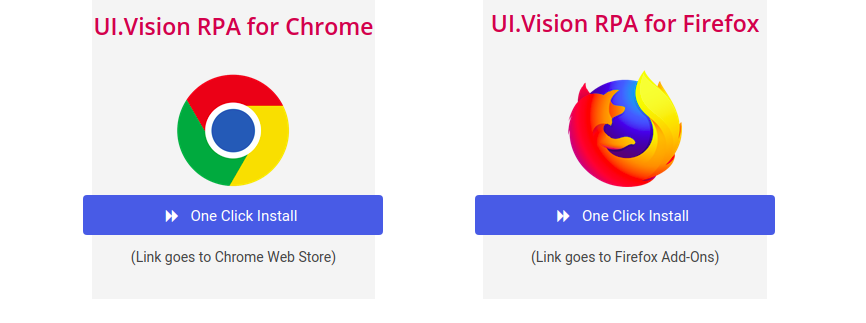

# mineria_opiniones
Pieza de código de automatización robotica de procesos para mineria de opiniones sobre productos basado en la herramienta de código abierto "Kantu, UI Vision" (A su vez basado en Selenium).

Extrae opiniones/reseñas de GooglePlay sobre un producto de manera autómatica.


## Instrucciones

0. Clonar este repositorio en tu maquina.

```
git clone https://github.com/codewithpatelo/mineria_opiniones.git
```

1. Ir a https://ui.vision/ y darle a "Add RPA to browser"


2. Instalar extensión correspondiente a tu navegador.



3. Darle a "Install XModules" (https://ui.vision/rpa/x/download)


4. Bajar instalador y seguir instrucciones de instalación en base a tu sistema operativo


5. Entrar a la extensión


6. En "Storage mode" seleccionar "File system" (OJO: Primero tenes que tener instalado el Xmodules)


7. Darle al icono de abrir (carpeta con el más) y darle click a "Import JSON".


8. Elegir mineria-opiniones.json de donde hayas clonado este repositorio.


9. Una vez cargado el macro, en el paso/step 3 del macro cambiar la variable "product" por el producto del que quieras extraer opiniones de Google Play. (Por default esta Glovo, recomiendo revisar en las urls de google play como figura el nombre de producto)


10. Darle a "Play macro"


11. Descargar CSV


